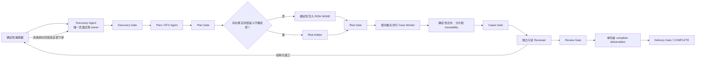

# 最终多 Agent 测试设计架构

本文件定义仓库直接采用的最终运行架构，不是版本演进、灰度方案或可选模式。新建批次的 `agent_mode` 固定为 `required`；Agent 负责受限范围内的认知与内容生成，确定性编排器负责顺序、隔离、指纹、门禁、合并、返工和交付事务。

页面实探、DFX、用例质量、Excel 和资产规则仍以 `.codebuddy/rules/test-design-rule.md`、`docs/test-design/rules/`、模板规范及现有验证器为权威。本架构只规定这些规则怎样由多个角色可靠执行，不复制或降低任何业务门禁。

正式测试设计仍固定为 8 Sheet；不新增 `测试系统导入用例` Sheet，需要导入时由单写者从独立模板副本生成独立导入文件。

## 总体结构



核心原则：

- 单一状态机：只能按 `discovery → plan → risk → cases → review → delivery` 前进，模型不能声明阶段通过。
- 单一页面事实 owner：Discovery 不并行，避免同一控件、角色、数据状态和 CRUD 生命周期被不同 Agent 拼接成矛盾事实。
- 有界并行：只在计划冻结后按精确功能点并行 Case Worker；同一功能点只有一个 worker owner。
- 隔离写入：Agent 只写任务 workspace，不能直接修改正式账本、manifest、Excel、产品事实或其他任务目录。
- 确定性合并：编排器按计划 owner 顺序校验并生成正式 001..N 分片、manifest、traceability 和派生计数。
- 独立审查：Reviewer 与所有 Case Worker 的任务身份不同，只读审查，不能修改被审产物。
- 单写者交付：只有标准 `complete-deliverables` 事务可以生成、复制、归档和同步正式交付件。

## 角色与职责边界

| 角色 | 唯一职责 | 主要输出 | 禁止事项 |
| --- | --- | --- | --- |
| Discovery Agent | 独立盘点并实际执行全量页面交互、逐选项、创建与逐修改项生效闭环 | inventory、discovery、逐选项账本、生命周期、证据 | 并行拆分 discovery；把可页面验证问题转给用户；直接写正式账本 |
| Plan / DFX Agent | 基于冻结 discovery 生成元素计划、预算、DFX 12×4 评估、风险候选和 7 个非功能用例 Sheet JSON，并只回填逐选项/生命周期的计划用例关联 | `element-case-plan.csv`、只修改关联字段的逐选项/生命周期账本、`dfx-assessment.json`、`risk-candidates.json`、Sheet JSON | 修改 discovery 事实；绕过元素骨架按 DFX 批量造用例 |
| Risk Arbiter | 过滤风险候选，仅保留页面完成验证后仍需外部语义或依赖的真实确认项 | `risk-confirmation.csv`、更新后的 `risks.json` | 接收“只展开、未点击、权限未知”等页面缺口；放行未完成 discovery |
| Case Worker | 只生成分配功能点的计划用例与逐用例追踪 | `function_cases.json`、`case-traceability.json` | 修改计划或其他功能点；直接写正式 shard/manifest；自报 cases 总门禁通过 |
| Reviewer | 对 cases 正式事实做独立、只读语义审查 | `review-report.json` 或结构化返工 | 修改账本、用例、traceability 或 Excel；与生成任务复用同一任务身份 |
| Delivery | 确定性单写者，不是生成 Agent | 8 Sheet 正式 Excel、独立导入文件、归档、receipt、产品事实投影 | Review 前交付；手工复制或用临时脚本保存正式 Excel |

Risk Arbiter 是条件角色。`risk-candidates.json` 为空时，编排器使用现有确定性能力写入唯一 `RISK-NONE`；有候选时才发出 Risk Agent 任务。

DFX assessment 的“需补充证据”不能成功提交，必须返工 discovery/plan；“待确认”维度必须与外部语义候选的 `dfx_dimensions` 精确对应；“适用”维度必须落入计划 Sheet JSON。`dfx-assessment.json` 会进入正式 data、Reviewer 输入和 Review 指纹，不能作为未审的旁路文件。

## 状态机与通过权

状态从 `INIT` 开始。每个阶段有 `*_RUNNING` 和 `*_VALIDATED` 状态；全部 delivery 门禁通过后才进入 `COMPLETE`。只有编排器在调用既有验证器成功后才能写入 `*_VALIDATED`。

另外两个控制状态：

- `EXTERNAL_BLOCKED`：仅用于账号、验证码、权限、隔离环境、外部服务或必要测试数据等真实外部条件。`agent-resume` 恢复原运行阶段，不把阻塞当成已覆盖。
- `FAILED`：不可自动恢复的运行失败，保留失败原因用于人工诊断。

返工是唯一允许的后退路径。返工目标阶段及其全部下游阶段、任务提升和 Review 结论一并失效。例如逐选项缺口回到 discovery；DFX 或预算缺口回到 plan；重复步骤只需回到 cases；Review 报告自身格式问题回到 review。返工不能跳到尚未到达的后续阶段。

## 严格契约

所有跨 Agent 交换均使用 `schema_version=1.0.0` 的 JSON 契约，JSON Schema 位于 `docs/test-design/schemas/orchestration/`。

### AgentTask

任务包含 `task_id`、run/batch、phase、role、功能点 `owner_key`、只读输入快照、精确输出白名单/允许前缀、required gate、`source_fingerprint` 和 attempt。任务输入复制到 `orchestration/inputs/<task-id>/`，因此 Agent 读取的是冻结快照，而不是随时变化的共享文件。

任务包位于：

```text
artifacts/agent-work/<role>/<task-id>/meta/agent-task.json
artifacts/agent-work/<role>/<task-id>/meta/task-context.json
```

### AgentResult

结果只允许 `SUCCEEDED`、`FAILED`、`NEEDS_REWORK`、`EXTERNAL_BLOCKED`。它必须回传同一 task/role/source fingerprint、workspace 中全部且仅有的产物路径、受影响交互/用例、使用事实、required gate 摘要、结构化返工和错误信息。

`SUCCEEDED` 不能携带返工或错误；`NEEDS_REWORK` 必须至少携带一条 `ReworkRequest`；失败和外部阻塞必须给出错误原因。编排器重新计算当前输入指纹、逐文件核对 workspace 和输出白名单，再把验证前后哈希一致的文件原子固化到 `orchestration/accepted/<task-id>/`；后续合并、提升和 Review 只读取该可信快照，拒绝过期、越界、隐藏、缺失或验证后被替换的产物。

### TraceabilityRecord

每条功能用例必须精确记录 case ID、功能点、plan owner、交互实例 ID、逐选项观察 ID、生命周期 ID、证据 SHA256、worker task ID 和 generation source fingerprint。Case Worker 只填充编排器下发的预期追踪，不能发明归属。

### ReworkRequest

返工必须包含稳定 request ID、目标阶段/任务、标准 reason code、受影响 ID、证据、明确修复动作、source fingerprint 和 attempt。常用原因包括未执行元素、缺失选项、CRUD 未验证、页面可验证风险、DFX 缺口、预算不足、步骤/预期重复、功能点漂移、追踪缺口和交付不一致。

## 运行目录

`init-batch-run` 在标准叶子批次目录中创建最终架构元数据：

```text
<run-dir>/
  batch-scope.json
  ...标准批次账本...
  artifacts/
    data/                         # 经门禁提升后的正式 JSON 与分片
    evidence/                     # 正式证据
    screenshots/                  # 正式截图
    agent-work/
      <role>/<task-id>/
        input/                    # 任务私有输入区
        output/                   # Agent 唯一可写区
        meta/                     # AgentTask 与上下文
  orchestration/
    config.json                   # required、单 discovery、Review、单写者配置
    run-manifest.json             # 任务、状态和提升记录
    state.json                    # 可恢复状态机快照
    events.jsonl                  # 带序号/哈希链的追加事件账本
    tasks/                        # 发出的 AgentTask
    results/                      # 接受的 AgentResult
    inputs/                       # 每个任务的冻结输入快照
    accepted/                     # 已验收并绑定哈希的可信 Agent 输出快照
    promotions/                   # 原子提升记录
    rework-requests/              # 结构化返工
    checkpoints/                  # 运行检查点
    review-report.json            # 当前有效的独立 Review 结论
```

workspace 管理器拒绝路径穿越、符号链接、越界写入和非白名单产物。事件账本与编排器使用排他锁，避免多个调度者同时推进同一批次。
`run-manifest.json` 是状态 checkpoint 权威；启动恢复会核对并修复 `state.json` 投影，同时为因进程/磁盘异常未写完的状态、任务或结果事件补记 `AUDIT_*_RECOVERED`，事件哈希链仍保持连续可验证。

## Case Worker 并行与合并

`element-case-plan.csv` 通过后，编排器按计划首次出现顺序分组精确功能点。功能点少于默认阈值 3 时串行发放；达到阈值时最多并行 3 个 worker，配置允许 1–32，但并行度不改变 owner、顺序或门禁。

worker 结果先保留在隔离 workspace。所有当前功能点 worker 都成功后，确定性合并器执行：

1. 校验计划用例 ID、功能点、owner 顺序和逐条 traceability。
2. 校验同功能点连续、步骤与预期分别唯一且可判定。
3. 按计划顺序生成每片 1–10 条、从 001 开始无断号的正式分片。
4. 可容纳的同功能点不跨片；超过 10 条才在该连续区块内顺序切片。
5. 统一生成 `function_cases_manifest.json`、`case-traceability.json` 和从用例派生的状态分类计数。
6. 运行既有 cases 累积门禁；失败时不把 worker 自报结果当成通过。

## 独立 Review Gate

Review 绑定当前 generation session、generation source fingerprint 和全量 review source fingerprint。以下 12 项必须全部为 true：

1. cases gate 已通过；
2. inventory 与 discovery 完整；
3. 选择项全部实际执行；
4. CRUD 生命周期和实际生效已验证；
5. 页面可验证风险已解决；
6. plan 与 cases 对齐；
7. 操作步骤唯一；
8. 预期结果唯一；
9. 功能点连续；
10. DFX 在计划范围内；
11. traceability 完整；
12. 没有未关闭返工。

`verdict` 只有 `APPROVED` 可以通过；报告中不能保留阻塞或未解决问题。任何上游正式事实、generation session、分片、Sheet JSON、traceability 或规则变化都会使指纹失效，必须重新 Review。`complete-deliverables` 在产生任何交付副作用之前再次校验 Review。

## CLI 使用

初始化后，用统一 PowerShell 入口操作：

```powershell
# 推进状态并取得下一组可运行 AgentTask
scripts/run-test-design.ps1 agent-run --run-dir <run-dir> --json

# 查看状态且不推进业务阶段；必要时会依据 manifest 修复崩溃遗留的审计投影
scripts/run-test-design.ps1 agent-status --run-dir <run-dir> --json

# Agent 按 task packet 完成 output 后提交严格 AgentResult
scripts/run-test-design.ps1 agent-submit --run-dir <run-dir> --task-id <task-id> --result <agent-result.json> --json

# 真实外部阻塞解除后恢复原阶段
scripts/run-test-design.ps1 agent-resume --run-dir <run-dir> --json

# 只读复核当前 Review Gate
scripts/run-test-design.ps1 validate-review-artifacts --run-dir <run-dir>

# 仅当状态进入 DELIVERY_RUNNING 且 Review 有效时执行单写者交付
scripts/run-test-design.ps1 complete-deliverables --run-dir <run-dir> --module-path "<模块路径>" --batch-id <批次ID>

# 交付事务成功后再次推进，验证 receipt 并把状态收口为 COMPLETE
scripts/run-test-design.ps1 agent-run --run-dir <run-dir> --json
```

`agent-run` 不替模型执行任务；它只推进确定性状态、创建隔离任务并返回 `runnable_tasks`。执行器读取 task packet 与 task context，在指定 output 中写文件，再构造 AgentResult 交回 `agent-submit`。调度器可以对当前返回的 Case Worker 并行执行，其他角色按状态机串行。

保留 `pipeline-status` 和 `validate-batch-artifacts` 作为事实诊断与阶段验证入口；它们不是绕过 Agent 编排或 Review 的兼容后门。

## 稳定性与效率边界

- 编排器复用现有累积门禁、标准组装器和交付事务，不引入第二套质量判断。
- Agent 输入使用按阶段冻结的只读快照；只在 Case Worker 阶段并行，减少上下文重复与页面状态冲突。
- source fingerprint、generation session、review source fingerprint 与追加事件链共同拦截旧产物混入。
- 返工只重做责任阶段及受影响功能点，同时确定性失效全部下游，避免全量重跑和脏缓存复用。
- 正式账本、manifest、Excel 和产品事实都只有确定性单写者；Agent 内容错误不会直接污染权威资产。
- 旧的手工阶段命令仍可用于诊断，但最终架构批次必须以 `orchestration/run-manifest.json`、状态机和 Review Gate 作为交付前置条件。
